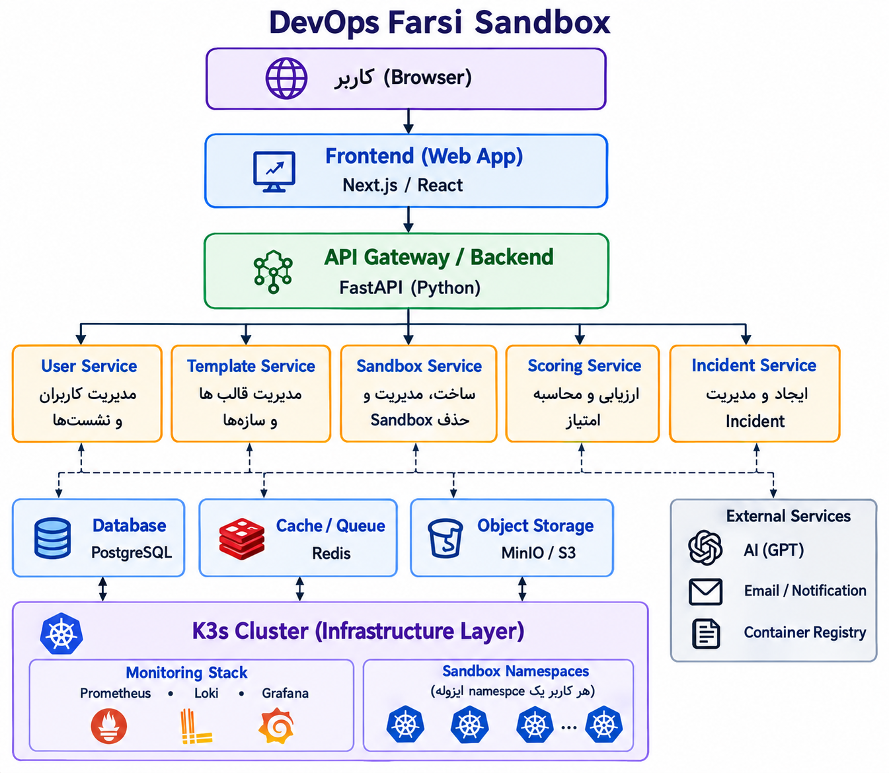

# DevOps Farsi Sandbox

## معرفی پروژه

DevOps Farsi Sandbox یک پلتفرم آزمایشگاهی برای یادگیری عملی DevOps است.

هدف پروژه این است که مهندس‌های DevOps بتوانند بدون نیاز به ساخت زیرساخت شخصی، وارد یک محیط واقعی و ایزوله شوند، سناریوهای مختلف را اجرا کنند، مشکلات را Debug کنند و مهارت‌های خود را در شرایط نزدیک به Production تقویت کنند.

در این پروژه، کاربر فقط وارد سایت می‌شود، یک سناریو انتخاب می‌کند و یک Sandbox اختصاصی دریافت می‌کند.

داخل این Sandbox کاربر به ابزارهایی مثل:

- Web IDE
- Terminal
- Monitoring
- Logs
- Metrics

دسترسی دارد و باید یک مسئله واقعی DevOps را حل کند.

---

# چرا DevOps Farsi Sandbox؟

یادگیری DevOps معمولاً دو مشکل اصلی دارد:

## 1. نبود محیط تمرینی واقعی

بسیاری از آموزش‌ها فقط توضیح می‌دهند:

- Kubernetes چیست؟
- Docker چیست؟
- Prometheus چیست؟

اما کاربر تجربه حل مشکل واقعی ندارد.

## 2. ساخت محیط تمرینی سخت است

برای تمرین واقعی معمولاً نیاز است:

- Kubernetes Cluster
- Monitoring Stack
- Application
- Database
- Network Configuration

راه‌اندازی شود.

این کار برای افراد تازه‌کار سخت است.

DevOps Farsi Sandbox این مشکل را حل می‌کند.

---

# چگونه کار می‌کند؟

Flow کلی در تصویر :

---

# قابلیت‌های اصلی

## Sandbox Isolation

برای هر کاربر یک محیط جدا ایجاد می‌شود.

هر Sandbox شامل:

- Namespace اختصاصی
- Resources محدود
- Network Policy
- RBAC
- Workspace
- Monitoring

است.

---

## Template Based Labs

تمام تمرین‌ها به صورت Template تعریف می‌شوند.

هر Template مشخص می‌کند:

- Architecture
- Difficulty
- Duration
- Required Resources
- Tasks
- Validation Rules
- Expected Result

مثال:
Template:

Nginx Reverse Proxy

Difficulty:
Easy

Duration:
30 minutes

Skills:

Nginx
Reverse Proxy
Networking
Debugging

---

# User Workspace

هر کاربر بعد از ساخت Sandbox یک Workspace دریافت می‌کند.

## IDE

محیطی برای:

- مشاهده فایل‌ها
- تغییر Configuration
- نوشتن Code

## Terminal

برای:

- بررسی سرویس‌ها
- Debug
- اجرای دستورات محدود

## Monitoring

برای مشاهده:

- Metrics
- Logs
- Service Status

---

# Roadmap

## Phase 1 - MVP

هدف:

ساخت اولین Sandbox قابل استفاده

Features:

- Simple login
- Template selection
- K3s integration
- Namespace creation
- Basic Workspace
- Terminal
- Monitoring
- Basic validation

---

## Phase 2 - Learning Engine

Features:

- Tasks
- Automated evaluation
- Score
- User progress
- Leaderboard

---

## Phase 3 - Incident Training

Features:

- Fault injection
- Production-like incidents
- Debugging scenarios
- Incident scoring

---

## Phase 4 - AI Assistant

Features:

- AI generated incidents
- Hints
- Learning suggestions
- User analysis

---

# Contribution

زمینه‌های مشارکت:

## Backend

- API Development
- Sandbox Lifecycle
- User Management
- Validation Engine

## Frontend

- Dashboard
- Template UI
- Workspace UI

## DevOps / Kubernetes

- K3s
- Helm
- Namespace Isolation
- Security

## Monitoring

- Prometheus
- Grafana
- Loki

---

# نتیجه نهایی

کاربر بعد از انجام تمرین:

- مهارت عملی کسب می‌کند
- نتیجه دریافت می‌کند
- Score می‌گیرد
- Progress او ذخیره می‌شود
